

<!-- _class: lead -->

# Demystifying the Internal Components of Kubernetes 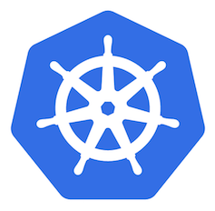

---

## ~$ whoami

Denis Germain

-  Site Reliability Engineer 
- French tech blogger : [blog.zwindler.fr](https://blog.zwindler.fr)*
 

  [@zwindler(@framapiaf.org)](https://framapiaf.org/@zwindler)

**#geek** 👨‍💻 **#SF** 🤖👽 **#runner** 🏃‍♂️

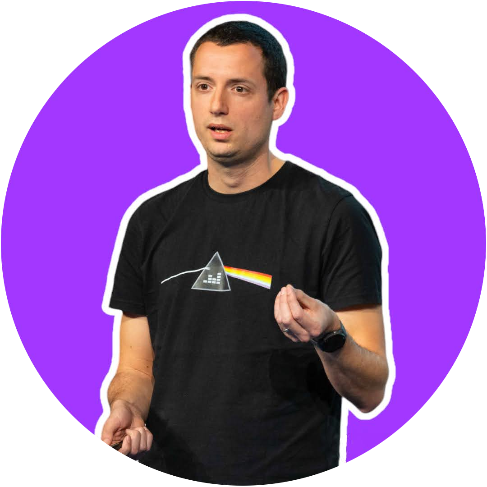

 

**the slides are on the blog*

---

<!-- _class: lead -->

# Demystifying the Internal Components of Kubernetes 

---

<!-- _class: lead -->

# Questions 🚨

---

## "Kubernetes is ✨ **magic** ✨" 🤩 (no, it's not)

In reality :
- Manage **infrastructure with APIs** (& YAML)
- Applications lifecycle and scale management
- Native high availability
- **Super extensible**

---

## A few  notions

**Node** or **Worker** : the server running the **Pods**

**Pod** : Kubernetes compute unit. 
1-n containers sharing 0-n volumes and an IP address

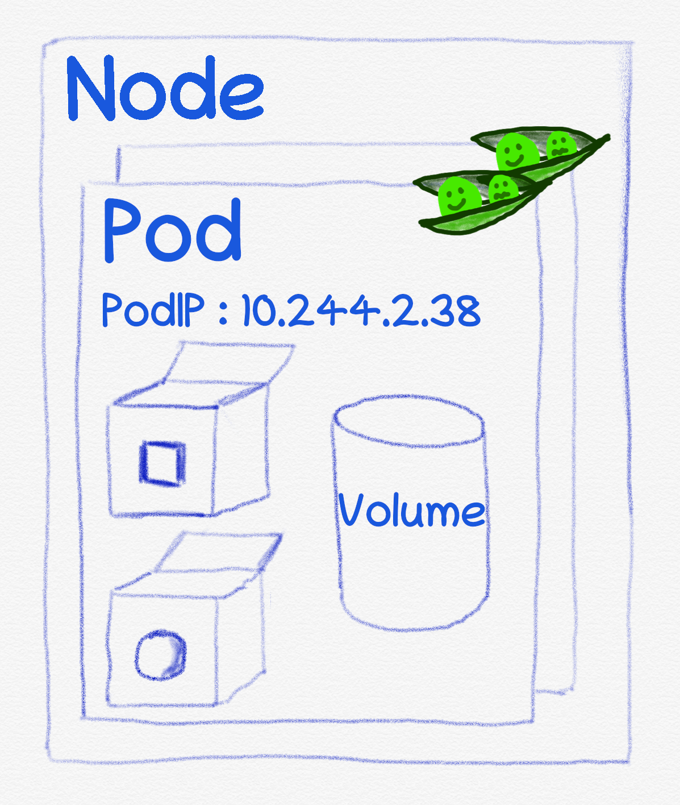

---

## Let's deploy an app!

3 APIs :
- [Deployment](https://kubernetes.io/docs/concepts/workloads/controllers/deployment/) 
(application)
- [Service](https://kubernetes.io/docs/concepts/services-networking/service/) (loadbalancer)
- [Ingress](https://kubernetes.io/docs/concepts/services-networking/ingress/) 
(reverse proxy)

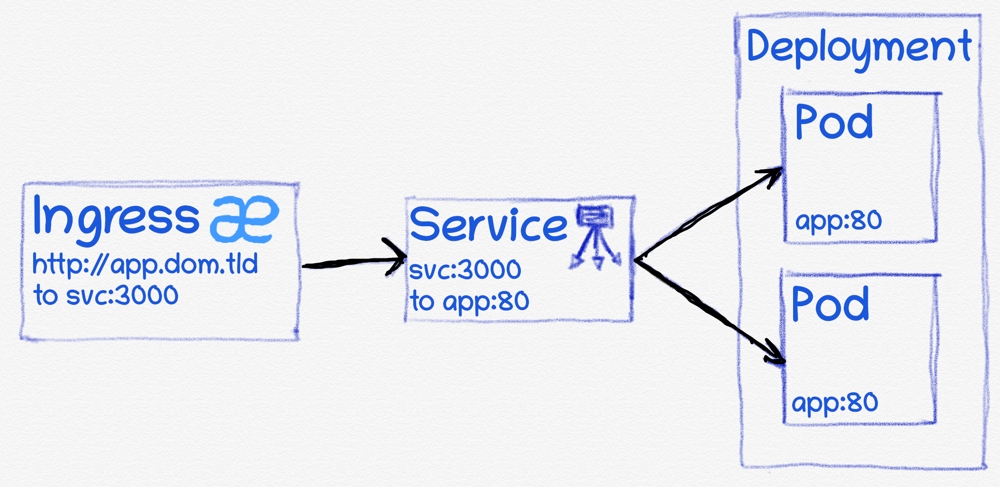

---

## What does it look like in YAML?

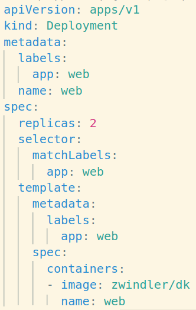 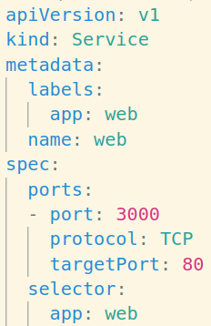 

---

<!-- _class: lead -->

# Cool, but how does it runs really under the hood 🚗 ?

---

### I want to play a game

- I'm going to deploy a web server in V(lang) using YAML manifests (easy)

- BUT, we'll deploy before that a Kubernetes cluster, binary by binary first

 

[github.com/zwindler/demystifions-kubernetes](https://github.com/zwindler/demystifions-kubernetes)

---

## API server

- Centralize the APIs (extensible)
- Abstract our infrastructure components

 

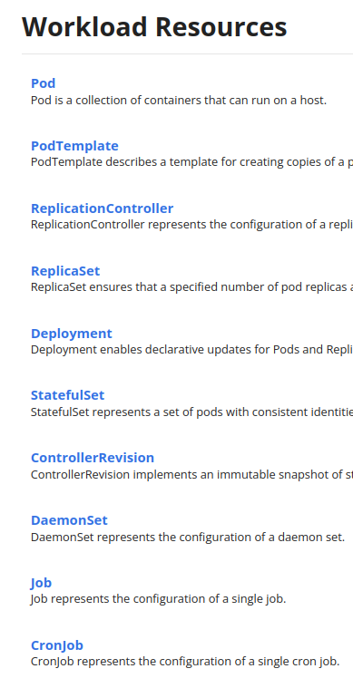

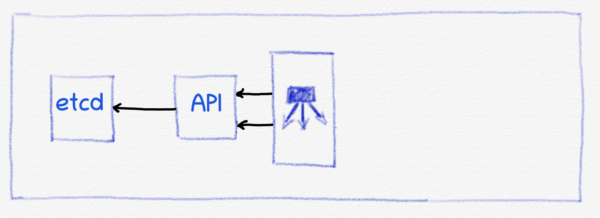

---

## etcd

- key value database
- distributed / fault-tolerant (raft)

 

---

## It's time to D-D-D-D-D-DEMO !

---

<!-- _class: lead -->

# "Scotty, I need more power"

---

## Controller Manager

Controllers are independant control loop softwares:
- Subscribe to events
- Act on events

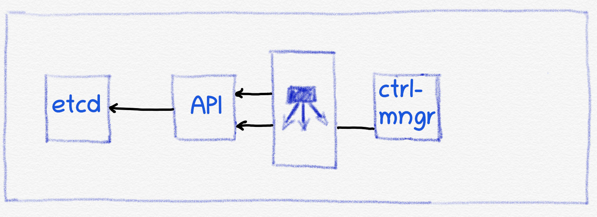

---

## A few controllers

- [ReplicationController](https://kubernetes.io/docs/concepts/workloads/controllers/replicationcontroller/)
- *endpoints* controller
- *namespace* controller
- *ServiceAccounts* controller

But also :
- CRDs / operators
- storage providers (CSI)

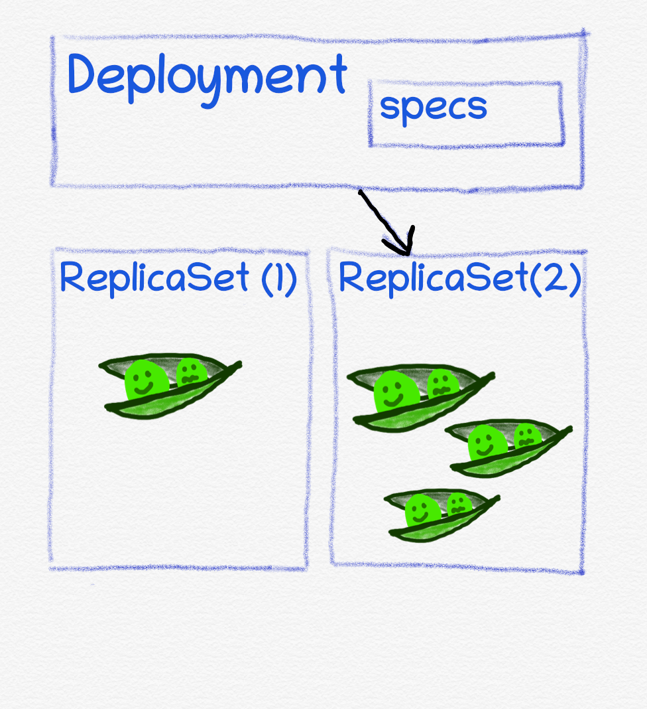

---

## Let's add a **controller-manager**

---

## Scheduler

How does Kubernetes know "where" to put a new **Pod**? 

- CPUs & RAM requests /  Affinity & anti-affinity / nodeSelector / taints & toleration ([see official documentation](https://kubernetes.io/docs/concepts/scheduling-eviction/kube-scheduler/))

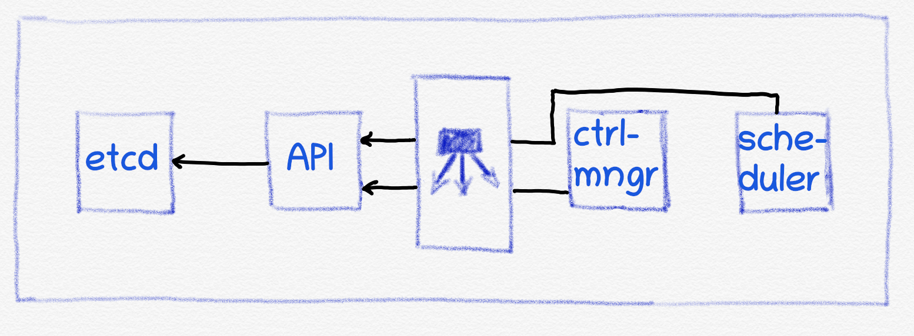

---

## Let's add a **scheduler**

---

<!-- _class: lead -->

# Now we have a working **control plane**
# But where are the **Nodes**?!

---

## kubelet

- Send/receive **Node** information
- Controls **container runtime**
  - adds/deletes **Pods**
  - checks **Pods** health
   

[Official documentation - kubelet](https://kubernetes.io/docs/reference/command-line-tools-reference/kubelet/)

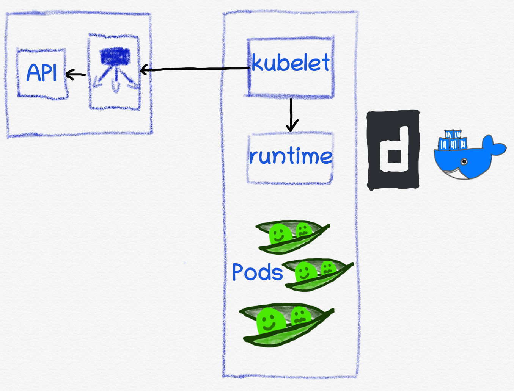

---

## Container runtime

To run the containers in the pods, we need a **container runtime**

At first,  
(`dockershim` is unsupported in 1.24)

Often replaced by `containerd` now, lot's of alternatives!

---

## Internal network 

 uses `iptables`, `ipvs`, ou `eBPF` to *simulate* the (*virtual*) network

> There is no IP

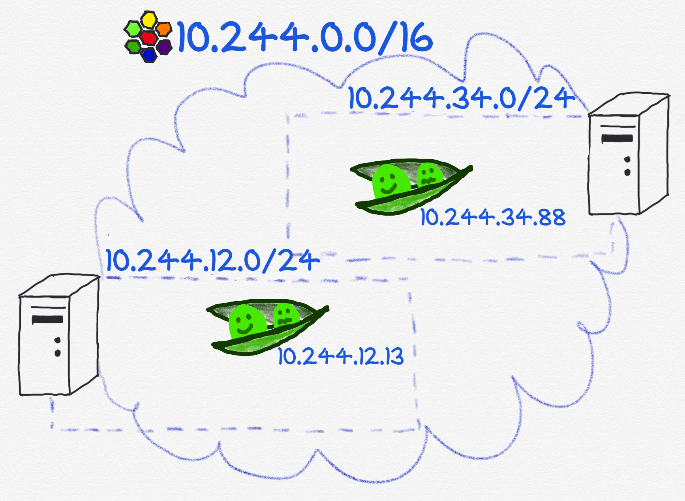

---

## CNI plugin

- **C**ontainer **N**etwork **I**nterface
- Kubernetes internal network
- CNI plugins = implementations of the CNI
  - 
  -  
  - 

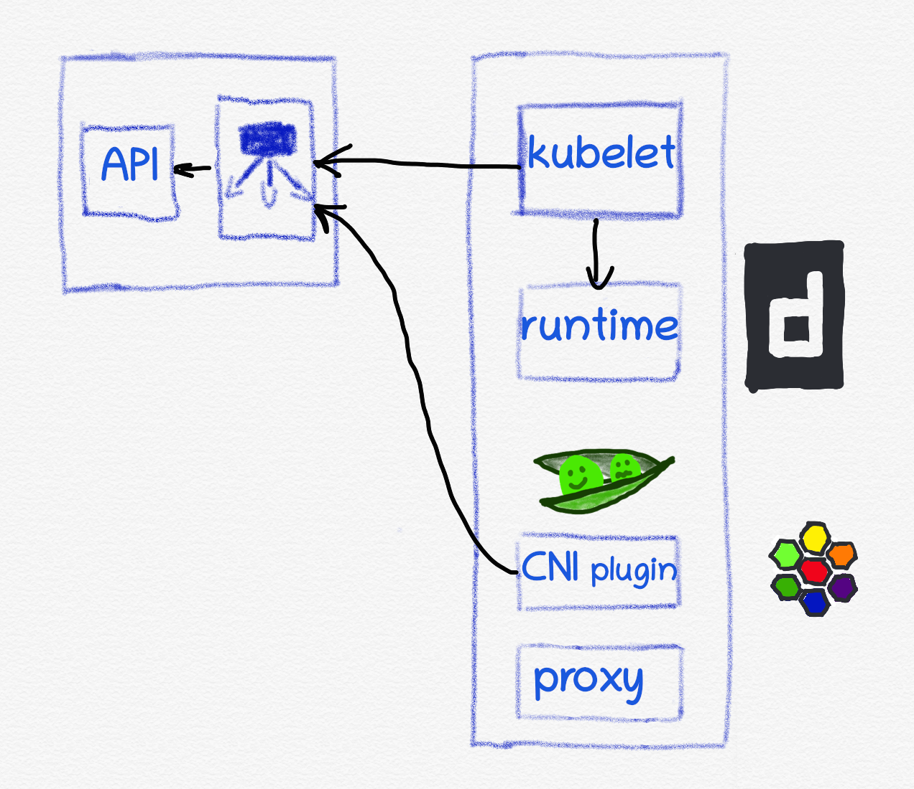

---

## kube-proxy (optional)

Component responsible of creating/managing dynamically `iptables` rules to route trafic from **Services** to living **Pods**

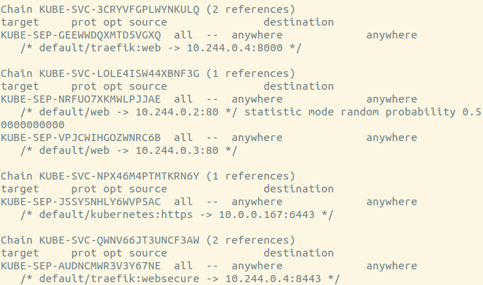

---

## We only need one more thing, I promise 🙃 

---

## IngressController

Routing HTTP(S) requests
- **IngressController** is a third party component managing **Ingress**

Note: **Ingress API** is being replaced by tge **Gateway API** (more powerful and more agnostic)
- [Kubernetes Gateway API](https://gateway-api.sigs.k8s.io/)

---

## End of the demo

---

##  is "only"

- an API server
- a scheduler
- control loops
- a *container runtime*
- a virtual network

  [@zwindler(@framapiaf.org)](https://framapiaf.org/@zwindler)

 Slides and sources on [blog.zwindler.fr/conférences](https://blog.zwindler.fr/conf%C3%A9rences/)

---

<!-- _class: lead -->

# Sources

---

## Sources / articles

- Sources
  - [github.com/zwindler/demystifions-kubernetes](https://github.com/zwindler/demystifions-kubernetes)
- Kubernetes "the hard way"
  - [github.com/kelseyhightower/kubernetes-the-hard-way](https://github.com/kelseyhightower/kubernetes-the-hard-way)
- [Medium.com - Madhavan Nagarajan - Kubernetes Internals: Architecture Overview](https://medium.com/@itIsMadhavan/kubernetes-internals-architecture-overview-2301ce80df32)
- [github.com/shubheksha/kubernetes-internals](https://github.com/shubheksha/kubernetes-internals)
- [K8s: A Closer Look at Kube-Proxy](https://betterprogramming.pub/k8s-a-closer-look-at-kube-proxy-372c4e8b090)

---

<!-- _class: lead -->

# Backup slides

---

## Talks / conferences on the same topic

- Carson Anderson - Kubernetes Deconstructed
  - [Version talk Kubecon](https://www.youtube.com/watch?v=90kZRyPcRZw)
  - [Version talk complet](https://www.youtube.com/watch?v=JhTaue0C1kk)

- Jérôme Petazzoni - Dessine moi un cluster
  - [github.com/jpetazzo/dessine-moi-un-cluster](https://github.com/jpetazzo/dessine-moi-un-cluster)
  - [Talk Lisa19](https://www.youtube.com/watch?v=3KtEAa7_duA)

- [Kubernetes Design Principles: Understand the Why](https://www.youtube.com/watch?v=ZuIQurh_kDk)

---

## What is a **container** ?

**It's a box!** 😂

- Process (or software)
- Run by "runtime"
- Isolated from other process on host
- Not only !
(microVMs, container 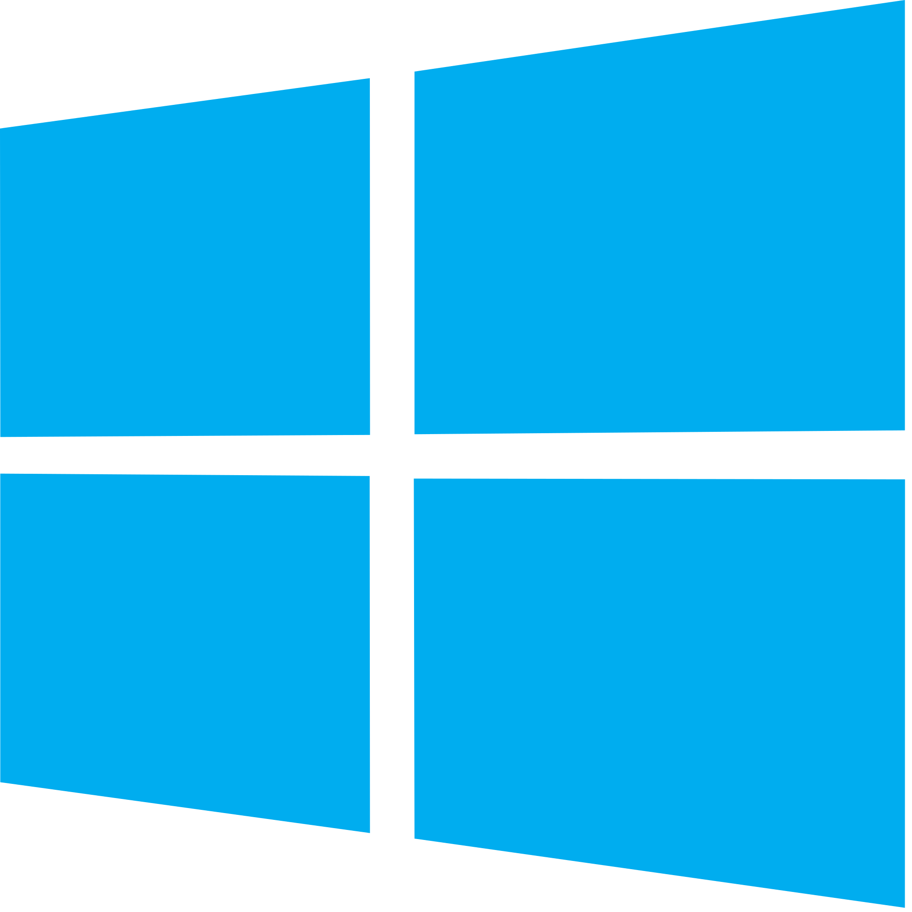, WASM ...)

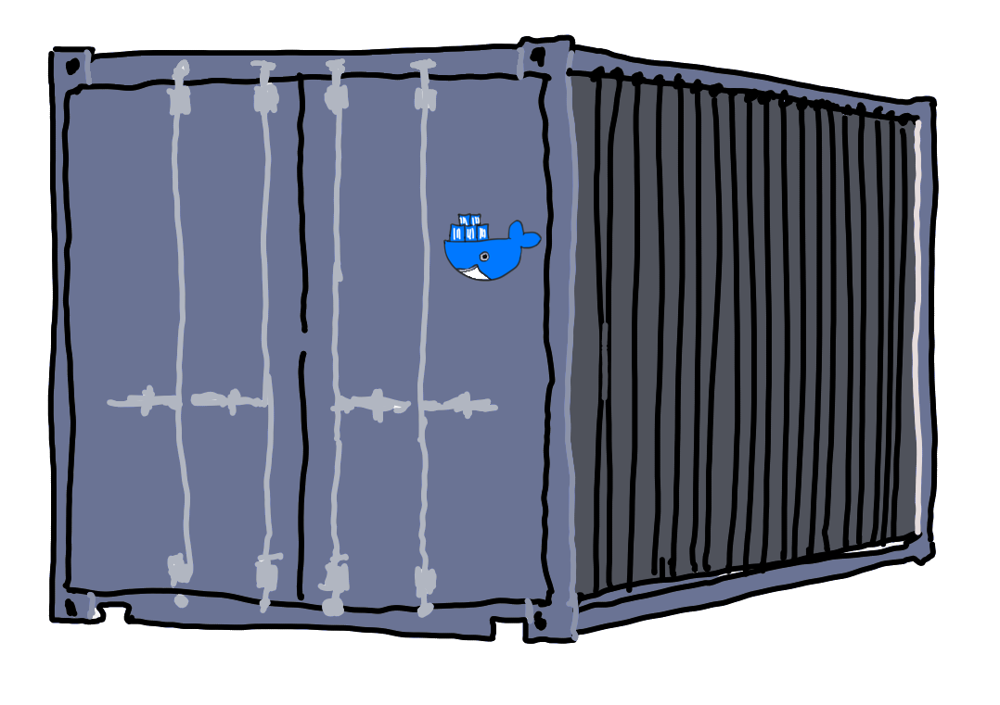

---

## What is **Kubernetes**?

- Container orchestrator
- Inspired by a Google production tool
- Open sourced and given to the CNCF in 2015
- *Won* the "orchestrator war"
  - Docker swarm 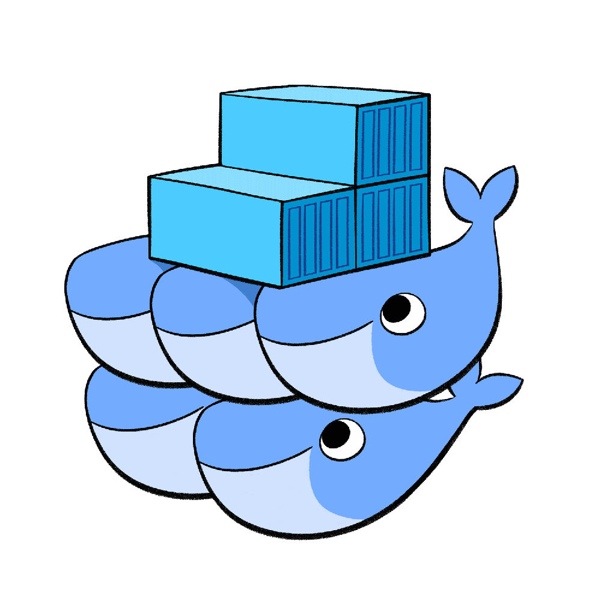
  - Mesos Marathon 

